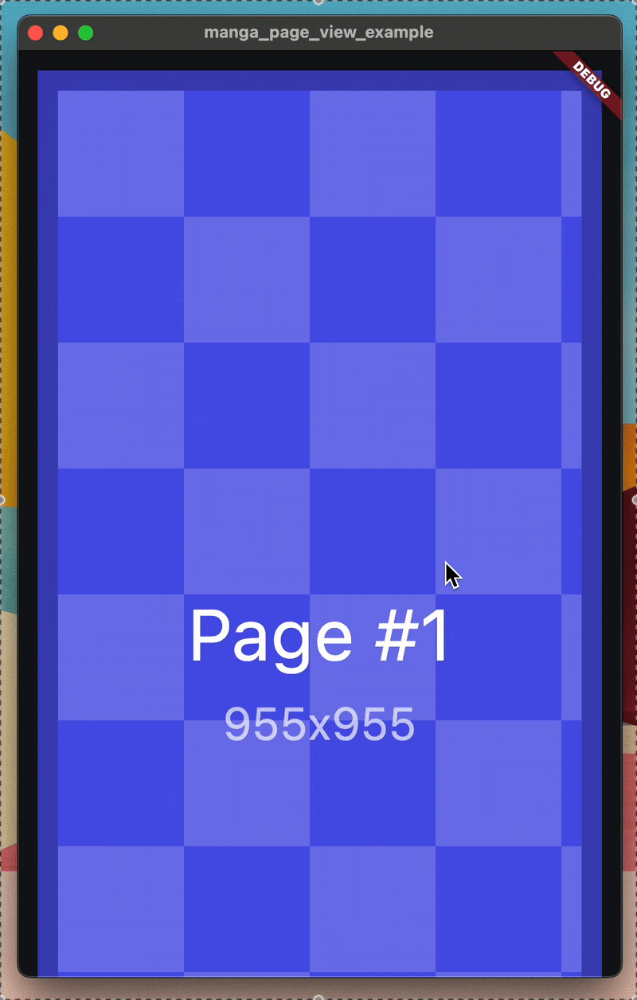

# MangaPageView

A Flutter widget designed to display comic and manga pages with intuitive navigation and customization options.

## Showcase

- Continuous mode


- Paged mode


## Features

* Two modes: continuous (webtoon, strip) or paged
* Four way reading direction: top-down, bottom-up, left-to-right, right-to-left
* Common pan and zoom gestures
  * Double tap to zoom
  * Pinch to zoom
  * Double tap and drag to zoom in/out
* Mouse and trackpad support (mouse wheel, pan, pinch)
* Edge gestures (previous/next chapters, etc)
* Toggleable overscroll options (vertical, horizontal, zooming)
* Internal widget cache
* Simplistic widget setup (using `pageBuilder`)
* Usable on all Flutter-supported platforms

## Examples

- Minimal usage
```dart
MangaPageView(
  mode: MangaPageViewMode.continuous,
  direction: MangaPageViewDirection.down,
  pageCount: 10, 
  pageBuilder: (context, index) {
    return Container(
      width: 500,
      height: 1500,
      decoration: BoxDecoration(
        color: Colors.grey.shade300,
        border: Border.all(color: Colors.grey.shade500, width: 8),
      ),
      alignment: Alignment.center,
      child: Text(
        'Page ${index + 1}',
        style: TextStyle(
          color: Colors.black,
          fontSize: 48,
          fontWeight: FontWeight.w300,
        ),
      ),
    );
  },
);
```

- Extensive usage
```dart
MangaPageView(
  mode: MangaPageViewMode.continuous, // Long horizontal strip
  direction: MangaPageViewDirection.right, // Right-to-left reading
  options: const MangaPageViewOptions(
    minZoomLevel: 0.5,
    maxZoomLevel: 8.0,
    initialZoomLevel: 1.0,
    presetZoomLevels: [1.0, 2.0, 4.0, 8.0],
    pageSenseGravity: MangaPageViewGravity.center,
    pageJumpGravity: MangaPageViewGravity.center,
    initialPageSize: Size(
      600,
      800,
    ), // Space to occupy when page widget not loaded yet
    pageWidthLimit: 1000, // Page width never exceeds this amount of width
    spacing: 16.0,
    padding: EdgeInsets.all(8.0),
    precacheAhead: 3, // Always load 3 page ahead from current
    precacheBehind: 3, // Always load 3 page behind from current
    mainAxisOverscroll:
        false, // Restrict horizontal axis from overscrolling
    crossAxisOverscroll:
        false, // Restrict horizontal axis from overscrolling
    zoomOvershoot: true, // Overshoot when zooming gives fluidity
    zoomOnFocalPoint: true,
  ),
  controller: MangaPageViewController(), // For programmatic control
  pageCount: 20, // Replace with your actual page count
  pageBuilder: (context, index) {
    // Replace with your actual page widget, perhaps an Image
    // Tips: always provide sizes or padding to your loading and error widgets, if available
    return Image.network(
      'https://picsum.photos/600/800?t=$index',
      fit: BoxFit.contain, // Confine images to page size, no cropping
      loadingBuilder: (context, child, loadingProgress) => Container(
        padding: EdgeInsets.all(24),
        alignment: Alignment.center,
        child: CircularProgressIndicator(),
      ),
    );
  },
  onPageChange: (index) {
    print('Current page: $index');
  },
  onZoomChange: (zoomLevel) {
    print('Current zoom: $zoomLevel');
  },
  onProgressChange: (progress) {
    print('Scroll progress: $progress');
  },
  pageEndGestureIndicatorBuilder: (context, info) {
    // Custom widget for edge gesture indicator
    return Container(
      color: Colors.black54,
      alignment: Alignment.center,
      child: Text(
        info.side == MangaPageViewEdgeGestureSide.end
            ? 'Next Chapter'
            : 'Previous Chapter',
        style: TextStyle(color: Colors.white),
      ),
    );
  },
  onStartEdgeDrag: () {
    print('Dragging from the start edge');
    // Potentially navigate to the previous chapter
  },
  onEndEdgeDrag: () {
    print('Dragging from the end edge');
    // Potentially navigate to the next chapter
  },
);
```

## More info
Feel free to check the documentation and examples for detailed usage.
